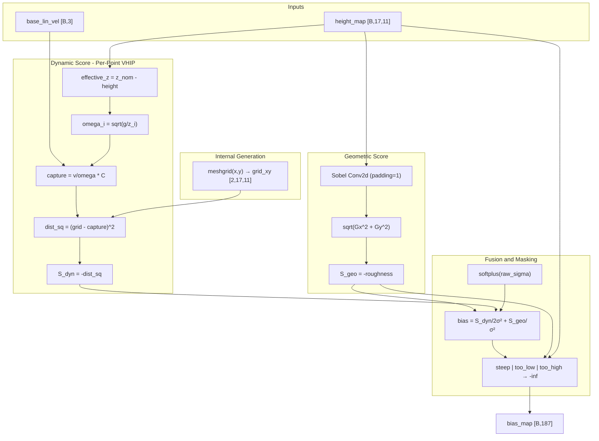

# TerrainSafetyScorer 物理引导注意力偏置模块实现计划 (v2)

## 1. 概述

创建独立的 `TerrainSafetyScorer` 模块，为 17x11 地形网格点打分。输出 `(B, H*W)` 的 Bias Mask，可注入 Attention Softmax 前。

## 2. 数据接口（简化版）

| 输入 | 形状 | 说明 ||------|------|------|| `height_map` | `[B, 17, 11]` | 采样点相对基准高度的差值（机体坐标系） || `base_lin_vel` | `[B, 3]` | 机体坐标系下的质心线速度 || `com_height` | `[B]` 或标量 | 当前质心高度（可选，默认使用 z_nominal） |**关键改进**：模块内部通过 `torch.meshgrid` 生成 x, y 坐标网格，无需外部传入 `terrain_xyz`。| 输出 | 形状 | 说明 ||------|------|------|| `bias_map` | `[B, 187]` | 未归一化的 logits，可加到 Attention Softmax 前 || `debug_info` (可选) | `dict` | 包含 S_dyn, S_geo, masks 的调试信息 |

## 3. 工程细节

### 3.0 Device 管理与 Batch 动态适配

```python
def __init__(self, ...):
    # 使用 register_buffer 注册网格，自动跟随模块的 device
    x = torch.tensor(measured_points_x)  # [17]
    y = torch.tensor(measured_points_y)  # [11]
    xx, yy = torch.meshgrid(x, y, indexing='ij')
    grid_xy = torch.stack([xx, yy], dim=0)  # [2, 17, 11]
    self.register_buffer('grid_xy', grid_xy)
    
    # Sobel 核也用 register_buffer
    self.register_buffer('sobel_x', sobel_x.view(1,1,3,3))
    self.register_buffer('sobel_y', sobel_y.view(1,1,3,3))

def forward(self, height_map, base_lin_vel, return_debug_info=False):
    B = height_map.shape[0]
    
    # 动态扩展网格到当前 batch size（使用 expand 避免内存复制）
    grid_xy = self.grid_xy.unsqueeze(0).expand(B, -1, -1, -1)  # [B,2,17,11]
    
    # grid_xy 自动与 height_map 在同一 device（因为 register_buffer）
    ...
```


## 4. 核心公式

### 4.1 几何平坦度分数 ($S_{geo}$) - 带 Padding

```python
# Sobel 卷积 - 必须使用 padding=1 保持维度
sobel_x = torch.tensor([[-1, 0, 1], [-2, 0, 2], [-1, 0, 1]])
G_x = F.conv2d(height_map.unsqueeze(1), sobel_x, padding=1)  # [B,1,17,11]
G_y = F.conv2d(height_map.unsqueeze(1), sobel_y, padding=1)  # [B,1,17,11]
roughness = torch.sqrt(G_x**2 + G_y**2).squeeze(1)  # [B,17,11]
S_geo = -roughness
```


### 4.2 动力学可行性分数 ($S_{dyn}$) - 逐点 VHIP

```python
# 逐点计算 omega（FastStair VHIP 核心）
effective_z = z_nominal - height_map  # [B,17,11]
effective_z = effective_z.clamp(min=0.1)
omega = torch.sqrt(g / effective_z)  # [B,17,11]

# 逐点计算理想捕获点偏移
# P_ideal_xy = v_com[:,:2] / omega * C_scaling
v_xy = base_lin_vel[:, :2].unsqueeze(-1).unsqueeze(-1)  # [B,2,1,1]
capture_offset = v_xy / omega.unsqueeze(1) * C_scaling  # [B,2,17,11]

# 距离计算
grid_xy = stack([grid_x, grid_y], dim=0)  # [2,17,11]
dist_sq = ((grid_xy - capture_offset) ** 2).sum(dim=1)  # [B,17,11]
S_dyn = -dist_sq
```


### 4.3 融合与掩码 - 增加深坑检测

```python
# 可学习温度参数（使用 softplus 保证正值）
sigma_dyn = F.softplus(self.raw_sigma_dyn) + 1e-6
sigma_geo = F.softplus(self.raw_sigma_geo) + 1e-6

# 融合
bias = S_dyn / (2 * sigma_dyn**2) + S_geo / sigma_geo**2

# === 安全掩码（三重检测）===
# 1. 粗糙度过大（悬崖边缘、陡坡）
steep_mask = roughness > roughness_threshold

# 2. 高度差过大（深坑底部）- 新增
too_low_mask = height_map < -height_drop_threshold  # e.g., -0.3m

# 3. 可选：高度差过高（无法跨越的台阶）
too_high_mask = height_map > height_climb_threshold  # e.g., 0.4m

# 合并掩码
unsafe_mask = steep_mask | too_low_mask | too_high_mask
bias[unsafe_mask] = -1e9
```


### 4.4 调试接口

```python
def forward(self, height_map, base_lin_vel, return_debug_info=False):
    ...
    # 最终输出
    bias_flat = bias.view(B, -1)  # [B, 187]
    
    if return_debug_info:
        debug_info = {
            'S_dyn': S_dyn.detach(),           # [B, 17, 11]
            'S_geo': S_geo.detach(),           # [B, 17, 11]
            'roughness': roughness.detach(),   # [B, 17, 11]
            'omega': omega.detach(),           # [B, 17, 11]
            'capture_point': capture_offset.detach(),  # [B, 2, 17, 11]
            'steep_mask': steep_mask,          # [B, 17, 11]
            'too_low_mask': too_low_mask,      # [B, 17, 11]
            'too_high_mask': too_high_mask,    # [B, 17, 11]
            'unsafe_mask': unsafe_mask,        # [B, 17, 11]
            'sigma_dyn': sigma_dyn.item(),
            'sigma_geo': sigma_geo.item(),
        }
        return bias_flat, debug_info
    
    return bias_flat
```


## 5. 模块架构




## 6. 文件结构

```javascript
my_MoRE/MoRE/rsl_rl/rsl_rl/modules/
├── terrain_safety_scorer.py    # TerrainSafetyScorer 模块

my_MoRE/MoRE/legged_gym/scripts/
├── test_terrain_scorer.py      # 测试脚本（含可视化）
```


## 7. 关键参数

| 参数 | 默认值 | 说明 ||------|--------|------|| `g` | 9.81 | 重力加速度 || `z_nominal` | 0.75 | 名义站立高度 (G1) || `C_scaling` | 1.0 | 捕获点缩放系数 || `roughness_threshold` | 0.5 | 粗糙度安全阈值 || `height_drop_threshold` | 0.3 | 深坑检测阈值（米） || `height_climb_threshold` | 0.4 | 可攀爬高度阈值（米） || `raw_sigma_dyn` | 0.0 (learnable) | 动力学温度（经 softplus 转换） || `raw_sigma_geo` | 0.0 (learnable) | 几何温度（经 softplus 转换） |

## 8. 测试用例

| 测试地形 | 预期行为 ||----------|----------|| 平地 + 静止 | 关注中心区域 || 平地 + 前进 | 关注前方（捕获点偏移） || 台阶上升 | 台阶面得分高，边缘被掩码 || 台阶下降 | 低平面被部分掩码（深度超限） || 深坑 | 坑底被完全掩码（即使平坦） || 斜坡 | 根据坡度渐变掩码 |

## 9. 实现步骤

1. **创建 `terrain_safety_scorer.py`**

- `__init__`: register_buffer 注册 Sobel 核、xy 网格；定义可学习参数
- `compute_geometric_score()`: Sobel 卷积 (padding=1) + 粗糙度
- `compute_dynamic_score()`: 逐点 VHIP + 捕获点距离
- `forward()`: 融合 + 三重掩码 + 可选 debug_info 返回

2. **创建 `test_terrain_scorer.py`**

- 生成测试地形（平地、台阶、深坑、斜坡）
- 模拟不同运动状态