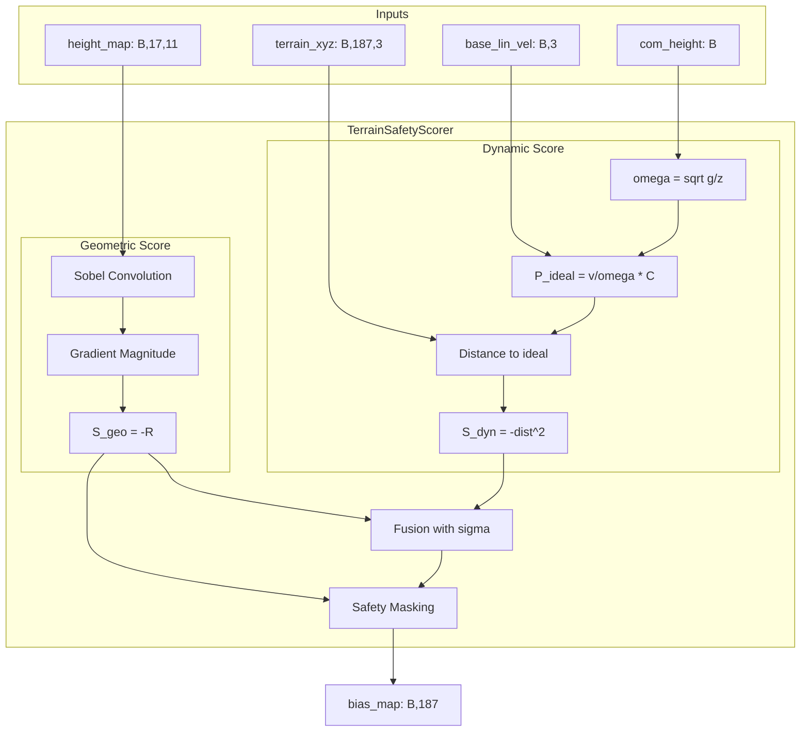

# TerrainSafetyScorer 物

理引导注意力偏置模块实现计划

## 1. 概述

创建一个独立的 `TerrainSafetyScorer` 模块，用于为 17x11 的地形采样网格点打分。该模块将结合：

- **动力学可行性分数 ($S_{dyn}$)**：基于 VHIP 模型计算理想落足点
- **几何平坦度分数 ($S_{geo}$)**：使用 Sobel 算子评估地形粗糙度

最终输出形状为 `(B, H*W)` 的 Bias Mask，可用于后续注入 Attention。

## 2. 数据接口

根据现有代码分析，输入数据格式如下：| 数据 | 形状 | 坐标系 | 来源 ||------|------|--------|------|| `height_map` | `[B, 17, 11]` | 机体坐标系 | `env.height_map` || `terrain_xyz` | `[B, 187, 3]` | 机体坐标系 | `env.terrain_xyz` || `base_lin_vel` | `[B, 3]` | 机体坐标系 | `env.base_lin_vel` || `com_height` | `[B]` 或标量 | 世界坐标系 | `env.root_states[:, 2]` |采样网格定义（来自 [g1_16dof_loco_config.py](my_MoRE/MoRE/legged_gym/envs/g1_loco/g1_16dof_loco_config.py)）：

- `measured_points_x = [-0.8, ..., 0.8]` (17点，间隔0.1m)
- `measured_points_y = [-0.5, ..., 0.5]` (11点，间隔0.1m)

## 3. 模块设计




## 4. 文件结构

新建以下文件：

```javascript
my_MoRE/MoRE/rsl_rl/rsl_rl/modules/
├── terrain_safety_scorer.py    # TerrainSafetyScorer 模块
└── ...

my_MoRE/MoRE/legged_gym/scripts/
├── test_terrain_scorer.py      # 测试脚本
└── ...
```


## 5. TerrainSafetyScorer 核心实现

### 5.1 几何平坦度分数 ($S_{geo}$)

```python
# Sobel 卷积核 (可学习或固定)
sobel_x = [[-1, 0, 1], [-2, 0, 2], [-1, 0, 1]]
sobel_y = [[-1, -2, -1], [0, 0, 0], [1, 2, 1]]

# 计算梯度幅值
G_x = conv2d(height_map, sobel_x)
G_y = conv2d(height_map, sobel_y)
roughness = sqrt(G_x^2 + G_y^2)
S_geo = -roughness  # 负值表示代价
```


### 5.2 动力学可行性分数 ($S_{dyn}$)

```python
# VHIP 自然频率
omega = sqrt(g / z_nominal)

# 理想捕获点 (机体坐标系下，机体在原点)
P_ideal_xy = v_com[:, :2] / omega * C_scaling

# 距离计算
dist_sq = (terrain_xy - P_ideal_xy)^2
S_dyn = -dist_sq.sum(dim=-1)
```


### 5.3 融合与掩码

```python
# 融合 (未归一化 logits)
bias = S_dyn / (2 * sigma_dyn^2) + S_geo / sigma_geo^2

# 安全掩码：粗糙度超阈值的点设为 -inf
mask = roughness > roughness_threshold
bias[mask] = -1e9
```


## 6. 测试脚本设计

创建独立测试脚本，不依赖 IsaacGym：

```python
# 测试地形类型
terrains = {
    "flat": 全零高度图,
    "step_up": 前半部分抬高0.1m,
    "step_down": 前半部分降低0.1m,
    "slope": 线性斜坡,
    "gap": 中间区域设为-inf,
    "rough": 随机噪声地形,
}

# 测试用例
1. 静止状态 (v=0) → 关注中心点
2. 向前行走 (v_x>0) → 关注前方
3. 向侧面行走 (v_y>0) → 关注侧面
4. 危险地形 → 验证掩码机制
```


## 7. 实现步骤

1. **创建 `terrain_safety_scorer.py`**

- 实现 `TerrainSafetyScorer` 类
- 包含 `compute_geometric_score()`、`compute_dynamic_score()`、`forward()` 方法
- 预留可学习参数 `sigma_dyn`、`sigma_geo`

2. **创建 `test_terrain_scorer.py`**

- 生成多种测试地形
- 模拟不同运动状态
- 可视化打分结果（热力图 + 理想落足点标记）

3. **验证后集成**（后续步骤，本次不实现）

- 将 bias 注入 `TerrainAttentionEncoder` 的 Softmax 前